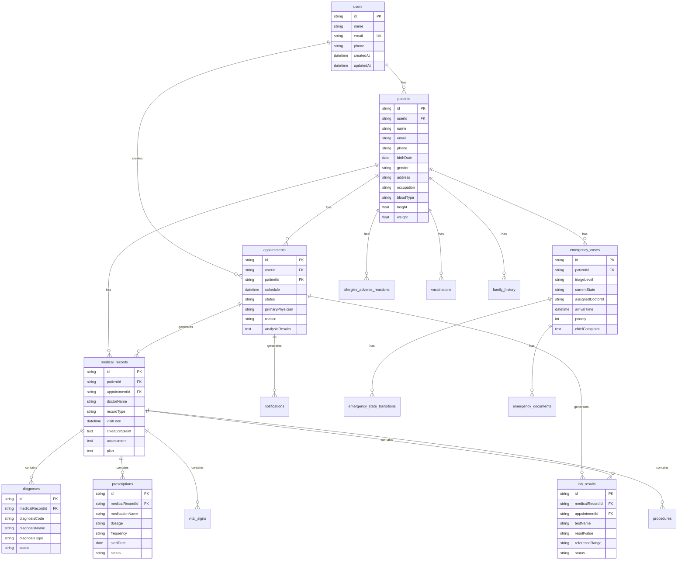
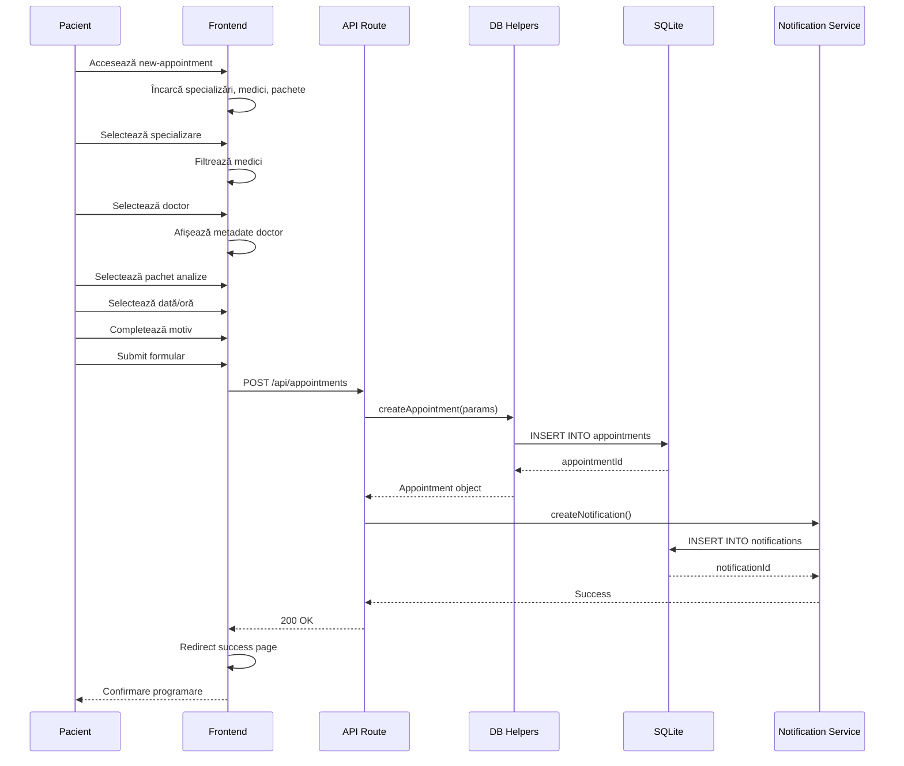
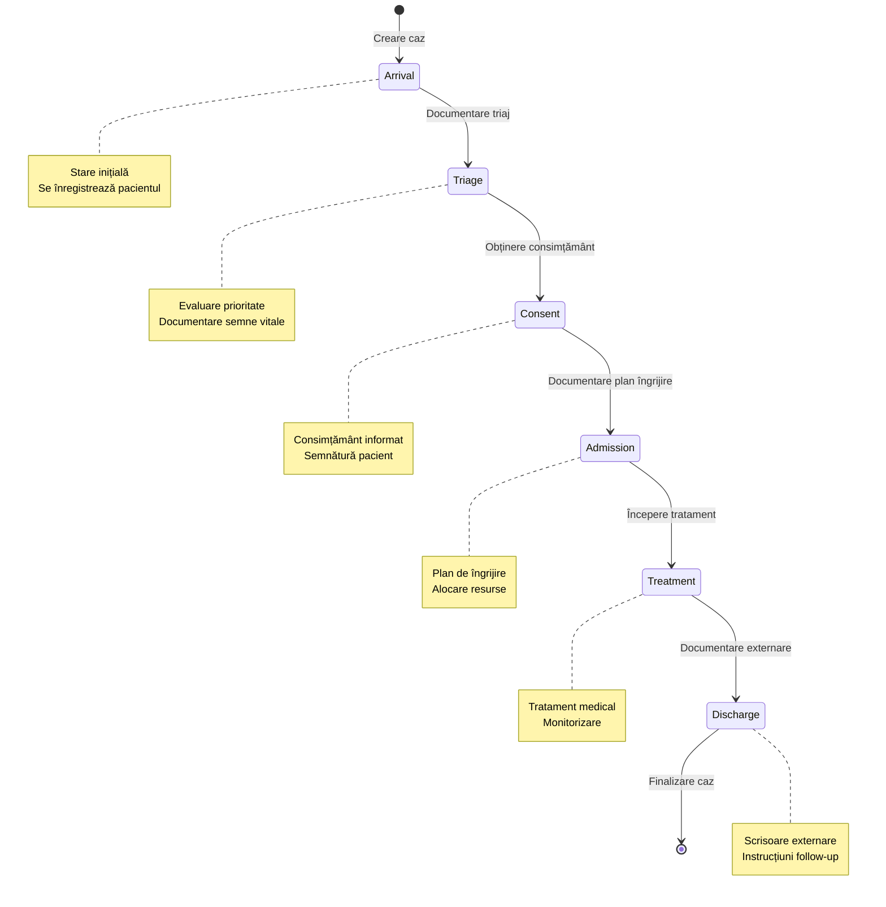
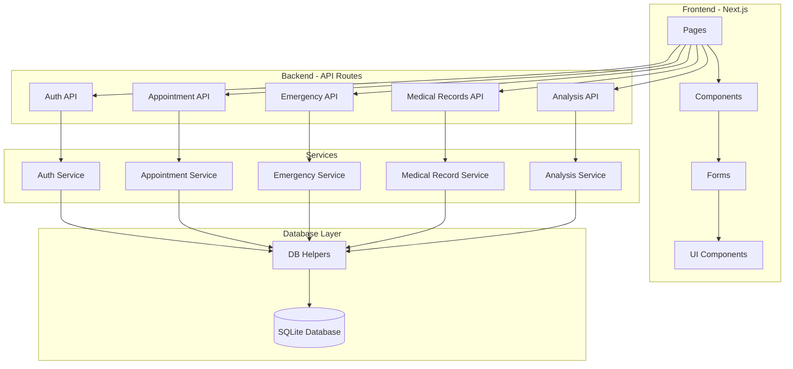

# Diagrame Mermaid - Platformă eHealth

## 1. Use Case Diagram

```mermaid
graph TB
    subgraph "Platformă eHealth"
        UC1[Autentificare]
        UC2[Înregistrare Pacient]
        UC3[Upload Document Identitate]
        UC4[Creare Programare]
        UC5[Vizualizare Programări]
        UC6[Anulare Programare]
        UC7[Selectare Pachet Analize]
        UC8[Vizualizare Istoric Medical]
        UC9[Vizualizare Consultații]
        UC10[Vizualizare Analize]
        UC11[Vizualizare Alergii]
        UC12[Vizualizare Vaccinări]
        UC13[Filtrare Medici]
        UC14[Vizualizare Detalii Doctor]
        UC15[Vizualizare Toate Programările]
        UC16[Gestionare Pacienți]
        UC17[Editare Consultație]
        UC18[Introducere Rezultate Analize]
        UC19[Creare Caz Urgență]
        UC20[Vizualizare Kanban Urgențe]
        UC21[Tranziție Stare Urgență]
        UC22[Documentare Triaj]
        UC23[Documentare Consimțământ]
        UC24[Documentare Plan Îngrijire]
        UC25[Documentare Externare]
        UC26[Programare Medici Gardă]
        UC27[Vizualizare Workload]
        UC28[Generare Rotație Automată]
        UC29[Vizualizare Notificări]
        UC30[Marcare Notificare Citită]
    end

    Patient[Pacient] --> UC1
    Patient --> UC2
    Patient --> UC3
    Patient --> UC4
    Patient --> UC5
    Patient --> UC6
    Patient --> UC7
    Patient --> UC8
    Patient --> UC9
    Patient --> UC10
    Patient --> UC11
    Patient --> UC12
    Patient --> UC13
    Patient --> UC14
    Patient --> UC29
    Patient --> UC30

    Doctor[Medic] --> UC1
    Doctor --> UC15
    Doctor --> UC17
    Doctor --> UC18
    Doctor --> UC19
    Doctor --> UC20
    Doctor --> UC21
    Doctor --> UC22
    Doctor --> UC23
    Doctor --> UC24
    Doctor --> UC25
    Doctor --> UC26
    Doctor --> UC27
    Doctor --> UC28

    Admin[Administrator] --> UC1
    Admin --> UC15
    Admin --> UC16
    Admin --> UC17
    Admin --> UC18
    Admin --> UC19
    Admin --> UC20
    Admin --> UC21
    Admin --> UC22
    Admin --> UC23
    Admin --> UC24
    Admin --> UC25
    Admin --> UC26
    Admin --> UC27
    Admin --> UC28

    UC2 -.->|include| UC3
    UC4 -.->|include| UC7
    UC4 -.->|include| UC13
    UC4 -.->|include| UC14
    UC8 -.->|extend| UC9
    UC8 -.->|extend| UC10
    UC8 -.->|extend| UC11
    UC8 -.->|extend| UC12
    UC21 -.->|extend| UC22
    UC21 -.->|extend| UC23
    UC21 -.->|extend| UC24
    UC21 -.->|extend| UC25
```

## 2. ER Diagram (Simplified)

## 3. Sequence Diagram - Creare Programare

## 4. State Machine - Emergency Case

## 5. Component Diagram

